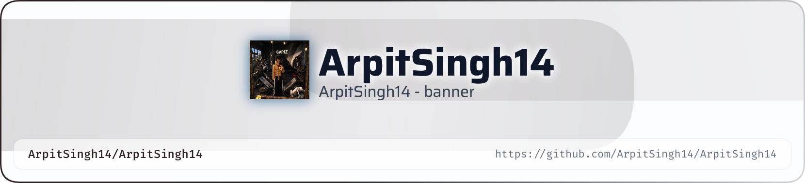

<!-- ═══════════════════════════════════════════════════════════════ -->
<!--                       PROFILE BANNER                           -->
<!-- ═══════════════════════════════════════════════════════════════ -->

<picture>
  <source media="(prefers-color-scheme: dark)" srcset="./art/header-dark.png">
  <source media="(prefers-color-scheme: light)" srcset="./art/header-light.png">
  
</picture>

  

<!-- ═══════════════════════════════════════════════════════════════ -->
<!--                         INTRO                                  -->
<!-- ═══════════════════════════════════════════════════════════════ -->

# 👋 Hey there, I'm **Arpit Singh**

 

  

 

---

## 💫 About Me

<table>
<tr>
<td width="65%" valign="top">

### 👨‍💻 Who Am I?

Hi! I'm **Arpit Singh**, a **B.Tech student** passionate about technology, software development, and continuous learning.

I'm currently exploring **AI/ML** while strengthening my foundations in **Web Development, Backend Development, and Problem Solving**.

I enjoy transforming ideas into working projects and learning new technologies by building things.

### 🚀 What I'm Currently Doing

- 🎓 Pursuing **B.Tech**
- 🤖 Learning **Artificial Intelligence & Machine Learning**
- 🌐 Building and exploring **Web Development**
- ⚙️ Learning **Backend Development**
- 🧩 Improving my **Problem-Solving & DSA skills**
- 💻 Working with **Java, Python, C & JavaScript**
- ⚛️ Exploring **React.js**
- 🎯 Working toward becoming a **Software Engineer**

### 💡 My Interests

- 🌐 Web Development
- 🧠 Problem Solving
- 🤖 Artificial Intelligence & Machine Learning
- ⚙️ Backend Development
- 🚀 Building Real-World Projects
- 📚 Learning New Technologies

</td>

<td width="35%" align="center" valign="middle">

  

  

</td>
</tr>
</table>

---

## 🛠️ Tech Stack

### 💻 Programming Languages

  

### 🌐 Web Development

  

### ⚙️ Backend Development

  

### 🔧 Tools & Technologies

---

## 🧠 Currently Learning

  

  

---

## 📊 GitHub Statistics

 

  

---

## 📈 GitHub Activity

---

## 🏆 GitHub Achievements

---

## 🐍 Contribution Snake

<!--
This section is generated automatically by GitHub Actions.

Create:
.github/workflows/snake.yml

The workflow should generate:
output/github-contribution-grid-snake.svg
output/github-contribution-grid-snake-dark.svg
-->

<picture>
  <source media="(prefers-color-scheme: dark)" srcset="./output/github-contribution-grid-snake-dark.svg">
  <source media="(prefers-color-scheme: light)" srcset="./output/github-contribution-grid-snake.svg">
  
</picture>

---

## 💻 What I Love Building

<table>
<tr>
<td align="center" width="25%">

### 🌐
### Web Apps

Modern and responsive web experiences.

</td>

<td align="center" width="25%">

### 🤖
### AI / ML

Exploring intelligent systems and machine learning.

</td>

<td align="center" width="25%">

### ⚙️
### Backend

Building reliable server-side applications.

</td>

<td align="center" width="25%">

### 🧩
### Problem Solving

Improving logic through coding and DSA.

</td>
</tr>
</table>

---

## 📚 My Development Journey

  

**🎯 Goal:** Become a skilled **Software Engineer** capable of building scalable, useful, and impactful software.

---

## 🌐 Let's Connect

  

---

## 💭 Developer Mindset

> ### **"Learn continuously. Build consistently. Improve relentlessly."**

 

---

## ⭐ Thanks for Visiting!

  

